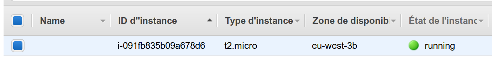
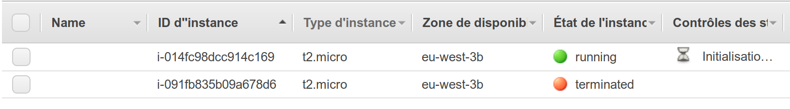

# Terraform Essentials

Lean how to setup terrafom
Understand commands and file organization

## What you will learn

* install and configure terraform
* define provider and resources
* apply changes to state
* destroy infrastructure


## What you will do

Launch an instance in AWS cloud and manage its state


## Terraform configuration


### Glossary

* provider : manage resource through api (ex: AWS)
* resource : physical or logical component that exists in infratructure


### Install Cli

Retrieve [package on your distribution](https://www.terraform.io/downloads.html)


Make sure that the `terraform` binary is available on the `PATH`.


Check this installation

```bash
$ terraform
Usage: terraform [--version] [--help] <command> [args]

The available commands for execution are listed 
```

## Infrastructure configuration 


Create an `example.tf` to describe configuration

More about [configuration language](https://www.terraform.io/docs/configuration/index.html) 


```hcl
provider "aws" {
  profile    = "default"
  region     = "eu-west-3"
}

resource "aws_instance" "example" {
  ami           = "ami-0e9e6ba6d3d38faa8"
  instance_type = "t2.micro"
}
```

We defined region "Paris" with "Amazon Linux 2 AMI (HVM)" on micro instance EC2

The profile attribute here refers to the AWS Config File in ~/.aws/credentials


## Initialization

Run after new configuration file (or checkout from repository)

```bash
 terraform init
```

You should see 

```bash
Initializing the backend...

Initializing provider plugins...
```

## Verify

Dry run 

```bash
terraform plan
```

You should see lines with all actions to perform and a recap with 1 pan to add 

```
Plan: 1 to add, 0 to change, 0 to destroy.
```

## Apply 

Let's create our instance in AWS cloud !

```bash
terraform apply
```


You should see the instance in AWS console




### State

terraform create a file `terraform.tfstate`

it keeps track of the IDs of created resources

>  Nb: We will see how to store remotely in further exercices


Manage current state :

```bash
terraform show
```

You should see informations about your resources 

```hcl
# aws_instance.example:
resource "aws_instance" "example" {
    ami                          = "ami-0e9e6ba6d3d38faa8"
    arn                          = "arn:aws:ec2:eu-west-3:108759337595:instance/i-091fb835b09a678d6"
    associate_public_ip_address  = true
    availability_zone            = "eu-west-3b"
    cpu_core_count               = 1
    cpu_threads_per_core         = 1
    disable_api_termination      = false
```


## Make changes


Replace AMI with another (Amazon Linux AMI 2018.03.0)

```hcl
resource "aws_instance" "example" {
  ami           = "ami-0652eb0db9b20aeaf"
  instance_type = "t2.micro"
  count = 2 # create 2 similar EC2 instances
}
```

Apply changes

```bash
terraform apply
```

Terraform informs you that the instance need to be replace

```bash
  # aws_instance.example must be replaced
-/+ resource "aws_instance" "example" {
      ~ ami                          = "ami-0e9e6ba6d3d38faa8" -> "ami-0652eb0db9b20aeaf" # forces replacement
      ~ arn                          = "arn:aws:ec2:eu-west-3:108759337595:instance/i-091fb835b09a678d6" -> (known after apply)
      ~ associate_public_ip_address  = true -> (known after apply)
      ~ availability_zone            = "eu-west-3b" -> (known after apply)
```

You can check in AWS console 



## Destroy infrastructure

All resources created are removed

Nb: it uses informations stored in `terraform.tfstate`

```bash
terraform destroy
```