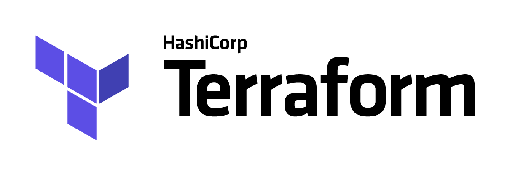

# Getting started Terraform

## About 

support for lessons

Pratice [Terraform](https://www.terraform.io/) with AWS Cloud provider

## Labs

* [Essentials](1_essentials/README.md)
* [CI/CD example](2_ci_cd/README.md)

## Tools used

* Terraform cli 

## Required 

You will need an AWS account 

Follow the [aws creation steps](aws_account.md) 

## Paiement

Depending of the ressources you will define, AWS free tier might not be enough

> Nb: your credit card can be charged ^^