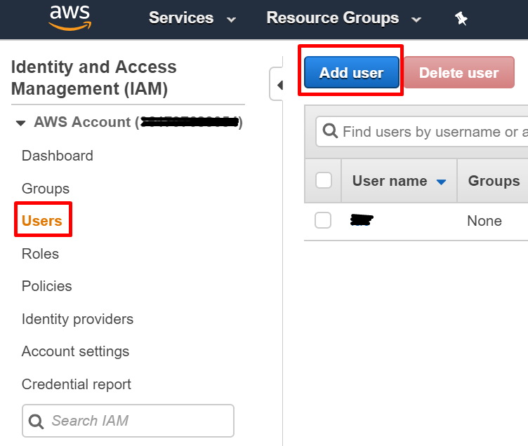

# Aws Account Creation

You  need to create an IAM user which will be used with Terraform.


navigate to [https://aws.amazon.com](AWS website)

Create an account or login to you AWS console

## Create IAM user 


### IAM service

Go to service IAM through dropdown list 


### Create Programatic user

Go to Users and press Add user




Choose name for you user :  terraform, deployer, iac

Select only "Programmatic Access" to generate access and secret keys
No need for web console 


### Attach policy

Attach admin policy "administratorAccess" to manage ressources 


### Tag (optional) 

You can add tags to your user

Example:  

* env = prod
* project = demo


### Review 

Review the account before creation


### Retrieve and store you secrets

Click on **Show in Secret** access key section. Copy and save in a safe place your Access key ID and Secret access key

> These informations are only showed once !  Keep them somewhere safe !


## Setup AWS Credentials


### install AWS cli


Follow instructions to install [AWS cli](https://docs.aws.amazon.com/fr_fr/cli/latest/userguide/install-cliv2.html) on your distribution

> Notes: we use last version 2

Check installation


```bash
$ aws2            
usage: aws [options] <command> <subcommand> [<subcommand> ...] [parameters]
To see help text, you can run:

  aws help
  aws <command> help
  aws <command> <subcommand> help
aws: error: the following arguments are required: command

```

Configure your credentials

```bash
$ aws2 configure    
```

You can check the informations stored  

```bash
cat ~/.aws/credentials
```

```bash
cat ~/.aws/config
```

### 

On the project's root folder, create a file called env-var which will store your AWS credentials.

```bash
vi env-var

```
The content should be as follows:

```bash
AWS_ACCESS_KEY_ID=<put your key here>
AWS_SECRET_ACCESS_KEY=<put your scret here>
AWS_DEFAULT_REGION=<put your AWS region here>
```


Regions examples : 

* Paris :  eu-west-3
* London :  eu-west-2
* Ireland : eu-west-1